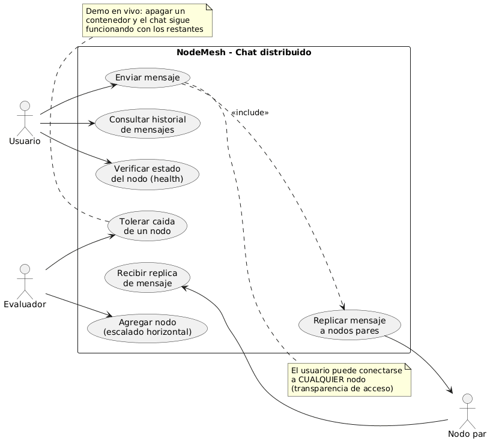
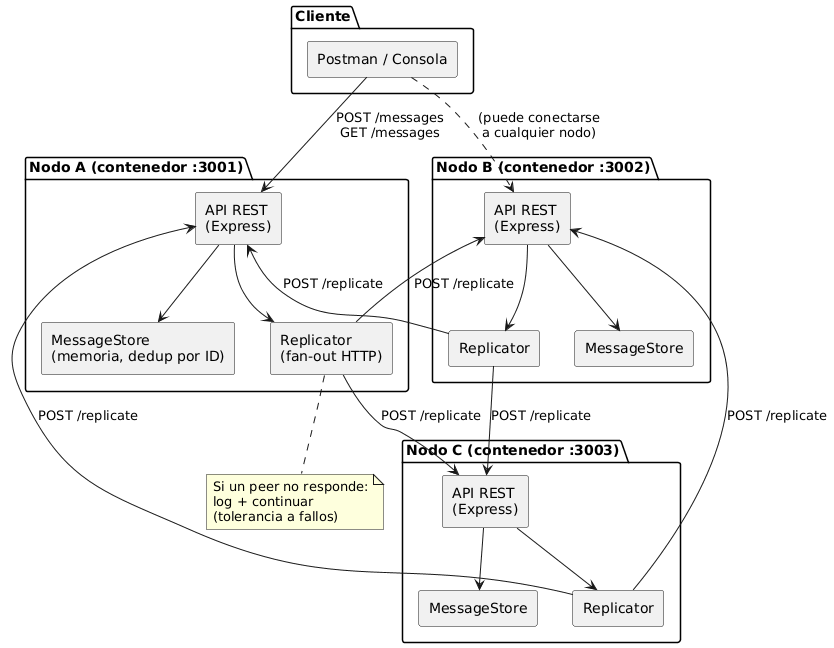
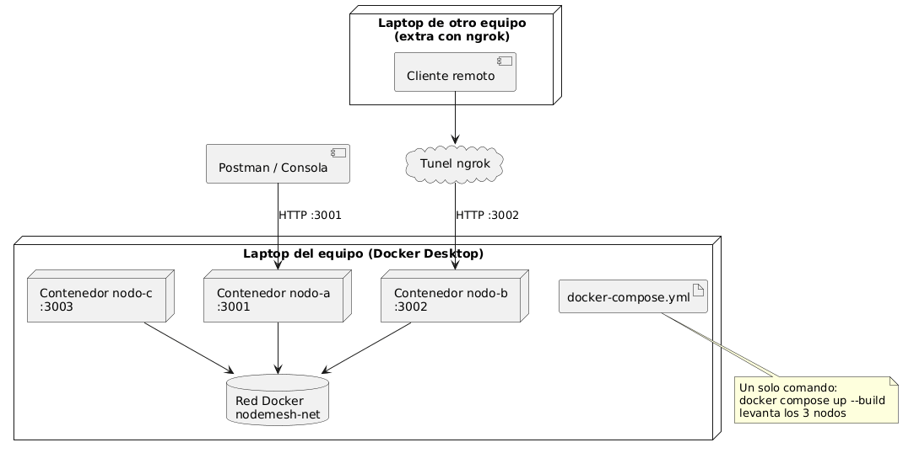

## Roles

**Backend:**
- Javier Abraham Cruz
- Abigail Hernandez Contreras

**Pruebas:**
- Briam Augusto Hernandez Cen

**Documentación:**
- Emily Ashanty May Aleman
- Alondra Lisstte Garcia Garcia

# NodeMesh — Chat Distribuido

**NodeMesh** es un sistema de chat distribuido: en lugar de depender de un único servidor central, el servicio está formado por **tres nodos independientes** que trabajan en conjunto. Cualquier usuario puede conectarse a cualquiera de los nodos y la experiencia es exactamente la misma: envía un mensaje en uno y ese mensaje aparece en todos.

El proyecto nace como una demostración práctica de los conceptos fundamentales de los **sistemas distribuidos**: concurrencia, transparencia de acceso, tolerancia a fallos, escalabilidad horizontal y arquitectura cliente-servidor.

## ¿Cómo funciona?

La idea central es sencilla: **no hay un centro, todos los nodos son iguales**.

1. Un usuario envía un mensaje a cualquier nodo (por ejemplo, al nodo A).
2. Ese nodo guarda el mensaje y, de inmediato, **lo replica** a los demás nodos (B y C) a través de la red.
3. Cada nodo que recibe la réplica la guarda, sin volver a reenviarla, evitando bucles infinitos.
4. Como todos los nodos tienen la misma información, cualquier usuario puede consultar el historial completo **sin importar a cuál nodo se conecte**.

Cada mensaje lleva un **identificador único**, de modo que si una réplica llega dos veces, el nodo simplemente la ignora: nunca habrá mensajes duplicados.

## Las preguntas que responde el sistema

**¿Cuántos nodos tiene el sistema?**

Tres nodos (`nodo-a`, `nodo-b` y `nodo-c`), aunque la arquitectura permite agregar más sin modificar el código.

**¿Cómo se comunican?**

Todos los nodos ejecutan **el mismo código fuente**; lo único que los diferencia son tres variables de entorno: su nombre (`NODE_ID`), su puerto (`PORT`) y la lista de sus compañeros (`PEERS`). Se comunican entre sí exclusivamente por **HTTP**, dentro de una red Docker propia. No existe memoria compartida, archivos compartidos ni bases de datos centralizadas: cada nodo guarda sus mensajes en su propia memoria.

**¿Qué pasa si uno falla?**

Nada grave. Si un nodo se apaga, los demás lo detectan al intentar replicarle: registran el fallo en su log y **continúan trabajando con normalidad**. El chat sigue funcionando con los nodos restantes, y los usuarios conectados al nodo caído solo tienen que conectarse a otro. De hecho, la demostración final del proyecto consiste en **apagar un nodo en vivo** mientras la conversación continúa.

## Conceptos de sistemas distribuidos que demuestra

- **Transparencia de acceso:** el usuario no necesita saber a qué nodo está conectado; todos ofrecen el mismo servicio y la misma información.
- **Replicación:** cada mensaje se copia a todos los nodos, con deduplicación por ID para garantizar consistencia.
- **Tolerancia a fallos:** la caída de un nodo no detiene el servicio; los errores se capturan, se registran y el sistema sigue operando.
- **Escalabilidad horizontal:** agregar un nodo nuevo solo requiere levantar otro contenedor con su configuración, sin tocar el código.
- **Concurrencia:** varios usuarios y nodos pueden enviar y recibir mensajes al mismo tiempo de forma independiente.

## Arquitectura

Cada nodo es un pequeño servidor **Node.js + Express** empaquetado en un contenedor **Docker**. Los tres contenedores se levantan con un solo comando (`docker compose up --build`) y se comunican a través de una red interna.

Cada nodo expone cuatro puntos de entrada:

| Método | Ruta | Quién la usa | Qué hace |
|---|---|---|---|
| `POST` | `/messages` | Clientes | Guarda el mensaje y lo replica a los demás nodos |
| `GET` | `/messages` | Clientes | Devuelve el historial completo de mensajes |
| `POST` | `/replicate` | Otros nodos | Guarda una réplica **sin** volver a reenviarla |
| `GET` | `/health` | Cualquiera | Informa el estado del nodo y sus compañeros |

La separación entre `/messages` y `/replicate` es deliberada: los mensajes de los clientes se propagan por toda la red, mientras que las réplicas entre nodos solo se almacenan, evitando que un mensaje rebote eternamente.

Los clientes (Postman o consola) hablan directamente con cualquier nodo por HTTP. Como extra, un nodo puede exponerse a internet mediante un túnel **ngrok**, permitiendo que otra computadora fuera de la red local participe en el chat.

## Diagramas

### Casos de uso

Muestra quién interactúa con el sistema y qué puede hacer: el usuario envía mensajes, consulta el historial y verifica el estado del nodo; los nodos pares reciben réplicas; y la caída de un nodo se tolera sin interrumpir el servicio.



### Componentes

Ilustra el interior de cada nodo: una API REST que recibe peticiones, un almacén de mensajes en memoria con deduplicación por ID, y un replicador que envía copias a los demás nodos por HTTP.



### Despliegue

Representa cómo se ejecuta el sistema en la práctica: tres contenedores Docker conectados por una red interna en la computadora del equipo, con la opción de un cliente remoto desde otra computadora a través de un túnel ngrok.



## Estructura del proyecto

```
nodemesh/
├── src/
│   ├── index.js              # Punto de entrada: lee la configuración y arranca el servidor
│   ├── app.js                # Aplicación Express: middlewares y montaje de rutas
│   ├── config.js             # NODE_ID, PORT y PEERS (desde variables de entorno)
│   ├── routes/
│   │   ├── messages.js       # POST /messages · GET /messages
│   │   ├── replicate.js      # POST /replicate (uso interno entre nodos)
│   │   └── health.js         # GET /health
│   └── services/
│       ├── store.js          # Almacén en memoria (Map por ID de mensaje)
│       └── replication.js    # Envío de réplicas a los nodos pares, tolerante a fallos
├── Dockerfile                # La misma imagen para todos los nodos
├── docker-compose.yml        # Define los 3 servicios: nodo-a, nodo-b y nodo-c
├── .env.example              # Ejemplo de NODE_ID / PORT / PEERS
├── postman/
│   ├── NodeMesh.postman_collection.json   # Colección con todas las peticiones
│   └── NodeMesh-Local.postman_environment.json  # Variables: URLs de los nodos y ngrok
├── package.json
└── README.md
```

## Cómo correrlo

### Opción 1: Docker (recomendada)

Requisito: tener Docker Desktop instalado y en ejecución.

```bash
docker compose up --build
```

Los tres nodos quedan disponibles en:

| Nodo | URL |
|---|---|
| nodo-a | http://localhost:3001 |
| nodo-b | http://localhost:3002 |
| nodo-c | http://localhost:3003 |

Para apagar un nodo en la demo (tolerancia a fallos):

```bash
docker stop nodemesh-nodo-c-1
```

### Opción 2: Sin Docker (3 terminales)

Requisito: Node.js 18 o superior.

```bash
npm install

# Terminal 1
NODE_ID=nodo-a PORT=3001 PEERS=http://localhost:3002,http://localhost:3003 npm start

# Terminal 2
NODE_ID=nodo-b PORT=3002 PEERS=http://localhost:3001,http://localhost:3003 npm start

# Terminal 3
NODE_ID=nodo-c PORT=3003 PEERS=http://localhost:3001,http://localhost:3002 npm start
```

## Probar con Postman

1. Abre Postman y usa **Import** para cargar los dos archivos de la carpeta `postman/`:
   - `NodeMesh.postman_collection.json` (las peticiones)
   - `NodeMesh-Local.postman_environment.json` (las variables con las URLs)
2. Selecciona el entorno **NodeMesh - Local** en el menú de arriba a la derecha.
3. Flujo de prueba sugerido:
   - `Estado del nodo A/B/C` → confirma que los tres nodos están activos.
   - `Enviar mensaje al nodo A`.
   - `Ver historial del nodo B` y `del nodo C` → el mensaje aparece en ambos (replicación).
   - Para la demo de tolerancia a fallos: apaga un nodo, vuelve a enviar un mensaje a otro nodo y revisa `Estado` para ver al nodo caído marcado como `caído`.

## Exponer un nodo a internet con ngrok

Permite que un compañero desde otra laptop participe en el chat (simula distribución geográfica real):

```bash
ngrok http 3001
```

ngrok mostrará una URL pública (por ejemplo `https://abcd-1234.ngrok-free.app`). El compañero remoto solo tiene que cambiar la variable `ngrok_url` del entorno de Postman por esa URL y usar las peticiones de la carpeta **Cliente remoto (ngrok)**.

